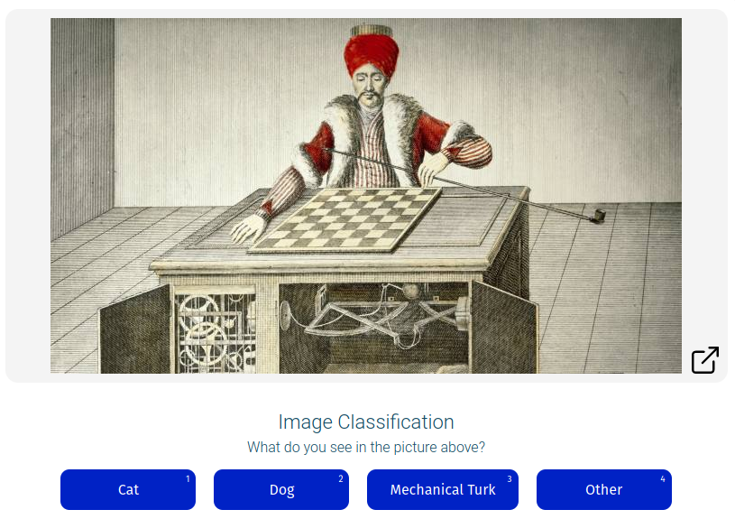
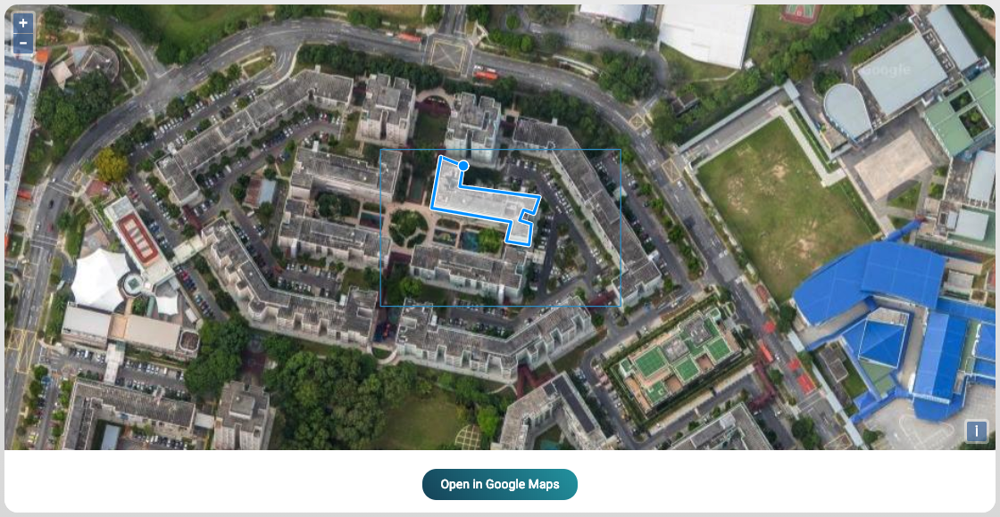

# Template

A template is simply some vanilla HTML that has a placeholder value that will be replaced with data when it is presented to the worker as a task. That's a bit of a mouthful; let's break it down.

Please visit [app.effect.network/preview](https://app.effect.network/preview) to see and use an interactive template preview. You will be able to test your templates here as well. 

Let's imagine we have an image classification campaign; we want to identify if there are cats in the picture. We present a picture to the worker, and it is their task to identify what is in the picture. They see an image and are provided a list of options to choose from. 


This is a template:
```html
<div id="task">
  <image src='${image_url}'></image>
  <h2>Image Classification</h2>
  <option submit name="button-answer" type="button" :options="['Cat','Dog','Mechanical Turk','Other']" label="What do you see in the picture above?"></option>
</div>
````

The template will render into the following image:


The worker is presented with an image that is loaded in via the placeholder annotation: `${variable_name}` and they are presented some kind of input field such as buttons in this case. But it could also be something else, such as a textbox.

They then submit the results, which get posted right away to the blockchain. 

## Effect Network GitHub Template 
You can more examples for your own projects on the [Effect Network Github](https://github.com/effectai/effect-force-templates).


## Parameter substitution

Note the use of `${image_url}` in the template, and the placeholder variable name can be anything you want. You do need to make sure that when it is loaded into the HTML template, it is valid. 
Multiple placeholders are supported but do make sure that each one has a unique name.

This is the variable that will be substituted by the array of placeholder values that is provided later on when a new batch is created. 
So later, the placeholder will be filled with `https://i.imgur.com/NP3BDFD.jpg` and rendered as the template below. 
When building your template, it is important to make sure that the way the placeholder is filled in eventually will render it into valid HTML. So if you decide to prefill the template with a URL, make sure that the data you pass into it is valid. 

```html
<div>
  '/>
</div>
```

Here we prefill the template with a URL, and all that needs to be done afterward is to pass an IPFS hash. This way, we can save on the costs of uploading data every time we create a new batch.


Of course, you can pass any `image_url` that you choose; in this quickstart guide, we will be looking at how to use IPFS.


## How input fields are processed
The input fields are the way that workers will fill in data into the task and submit it to the blockchain for you to be processed when needed. 
As with placeholders there can be multiple input fields as well.
Each place holder will need a name that is unique to the template.

Afterwards 

```html
<div>
  '/>
  <input type='text' name='image_input_name' placeholder='Placeholder text here.'/>
</div>
```

These will be available to you when you retrieve the results afterwards. 


<!-- ### How to encode json data -->


## Pipes
When submitting tasks through the placeholder, it will be sanitized. Otherwise you can use the pipe operator `|` to pass the data as is. 

```html
<div>
  '/>
  <input type='text' name='image_input_name' placeholder='Placeholder text here.'/>
</div>
```

## Submit all the Results
For now, we will be using a simple button with a `submit` event in order to submit the results. All you need is an element that supports the submit event and you should be ready to go.

```html
<div>
  '/>
  <input type='text' name='image_input_name' placeholder='Placeholder text here.'/>
  <button submit type='button'>Submit</button>
</div>
```

This will trigger the submission of the results to the blockchain, and you should be able to retrieve the results later from the blockchain. 


## Resize
Sometimes the iframe will be too small to render the template. In that case, you can use `forceResize` to resize the iframe. Even if the size of the template is dynamic, you can use this to make sure that the iframe will be loaded correctly and no scroll bars will be shown.

```html
<div>
  '/>
  <input type='text' name='image_input_name' placeholder='Placeholder text here.'/>
  <button submit type='button'>Submit</button>
  <script>setTimeout(() => window.forceResize(), 100)</script>
</div>
```
In this example we need to add a timeout to make sure the iframe can be resized after after everyting has properly rendered.


## Imagination

As we can see, the template has different elements to is. The one showcased above is a simple example, but it can be much more complex than that. 
One of our favorite use cases up until now that we've had is the polygon annotator as can be seen below. Where workers can draw polygons in an image of satellite imagery in order to identify buildings in the image. 



As you can see, it is also possible to add javascript to the template, in order to make the whole template dynamic and make it a full-fledged application within the worker interface. 

So go forth an let your imagination run wild. 
