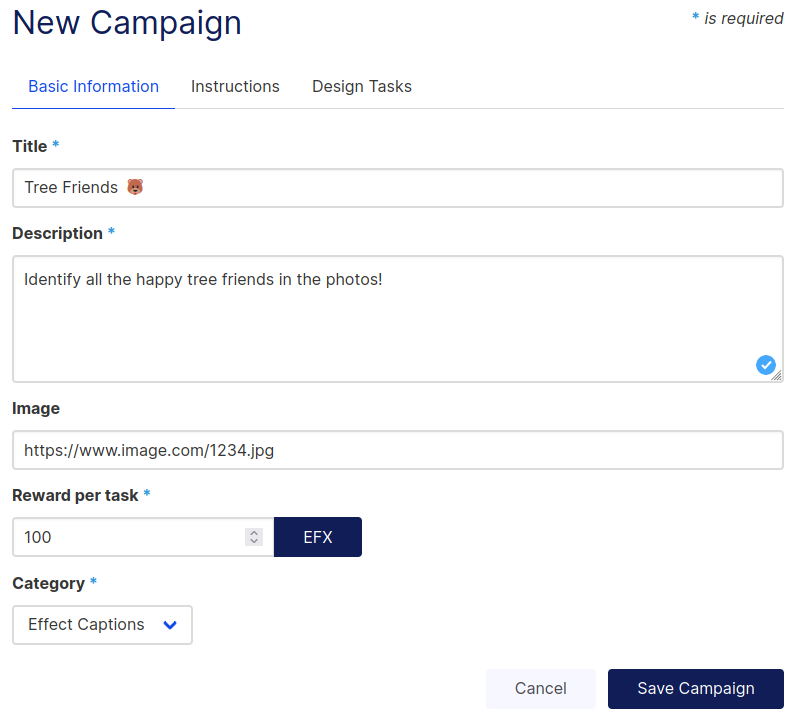
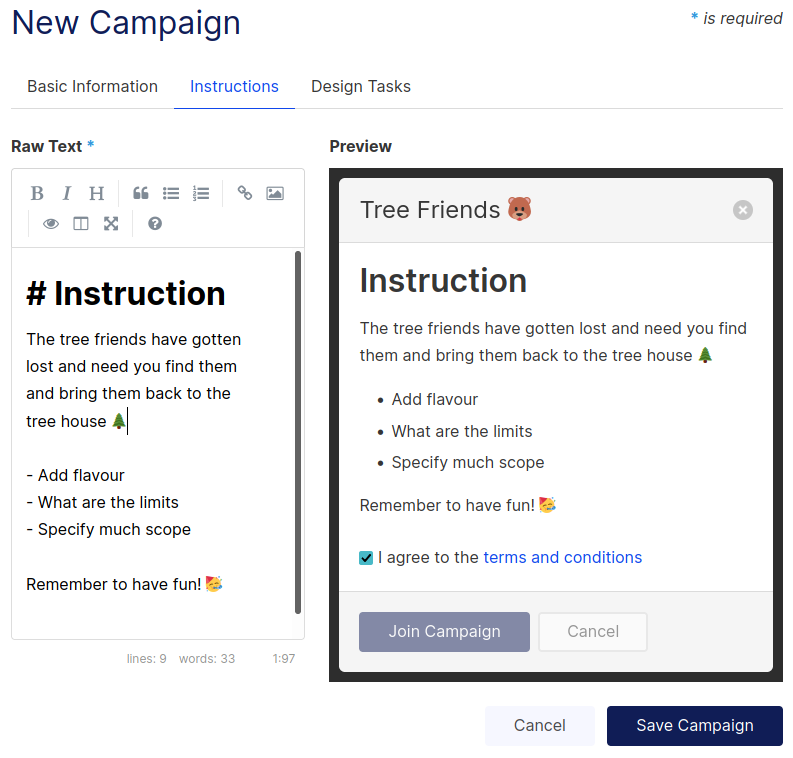
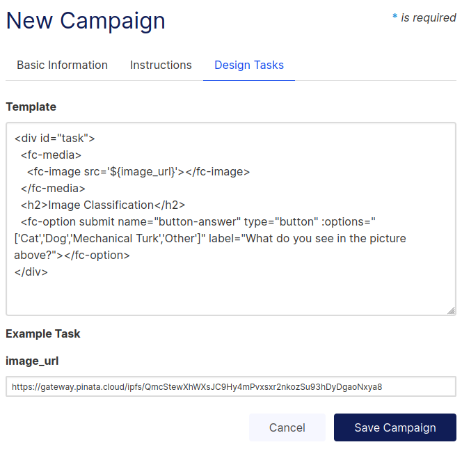

# Quickstart Guide

Introduction, Quick start, init client, create campaign, create task, publish task, response

With this quickstart guide, we'll delve into how to use the Effect Network SDK so that you can publish tasks on the platform. 

### Requirements

#### Node
At the moment, our SDK is built using Typescript and runs on NodeJS. If you do not have NodeJS installed, you can find it here:
[Download NodeJS for your platform.](https://nodejs.org/en/download/)

#### Keys - Is this even needed?
Valid BSC keys are needed to use the SDK.
We recommend you start with a burner wallet and generate a new key for initializing the client.

You can create a new one via the force interface.
Take a look at 

### Step 1. Initializing project

Start the project by creating a directory and initializing it as an npm directory.

```bash
mkdir awesome-efx-project
cd awesome-efx-project
```

### Step 2. Installing the SDK
In your project folder, you can now start installing packages that will assist you in your journey.

<code-group>
<code-block title="NPM">
```bash
npm i @effectai/effect-js
```
</code-block>

<code-block title="YARN">
```bash
yarn add @effectai/effect-js
```
</code-block>
</code-group>

:::tip 
If you are also building with Typescript, the types are included with the NPM package. You should be able to see 

<details>
<summary> Clone and build the code yourself. (Click to toggle section) </summary>

To start, you will need to import the SDK using either `require` or `import` as needed. 
At the moment, the npm package only supports CommonJS exports. If it does not work as needed, you can clone the GitHub repo and build the needed module format yourself. 
There are three module formats supported at the moment: [[CommonJS](https://nodejs.org/docs/latest/api/modules.html), [UMD](https://github.com/umdjs/umd), [ES6](https://developer.mozilla.org/en-US/docs/Web/JavaScript/Guide/Modules)]


```
git clone git@github.com:effectai/developer-docs.git
npm i
npm run build:umd
# OR
npm run build:es


# Then from your project folder link back to the package
npm link /path/to/effect-js
```
</details>

<br>
:::


### Initializing the Effect Client

:::warning Effect Network INTERNAL --- Remove this
Maybe instead of using javascript and typescript we can use something like mainnet and testnet.
:::

The first step is initializing the client, which will be used to interact with the Effect Network. 
Import as needed and pass a configuration object to the constructor. 
The constructor can take a configuration object, but the constructor will initilize with default parameters if none are passed, based on the first parameter. 
The first parameter is which network to use, it defaults to 'testnet' but can be changed to 'mainnet' when you are ready for production.
See [Configuration](../sdk/) for more information about the properties and their default values.


<code-group>
<code-block title="require">
```javascript
const EffectSDK = require('@effectai/effect-js'); 

const sdk = new EffectSDK.EffectClient(options);
const sdkOptions = {
  network: 'kylin',
  host: 'api.kylin.alohaeos.com',
  signatureProvider: window.eos.wallet // Specify the eos wallet provider you want to use.
  web3: window.web3 // Specify the web3 instance you want to use.
}
this.sdk = new effectSdk.EffectClient('testnet', sdkOptions)

```

</code-block>
<code-block title="import">

```javascript
import { EffectClient } from '@effectai';

const sdkOptions = {
  network: 'kylin',
  host: 'api.kylin.alohaeos.com',
  signatureProvider: window.eos.wallet // Specify the eos wallet provider you want to use.
  web3: window.web3 // Specify the web3 instance you want to use.
}
const sdk = new EffectClient('testnet', sdkOptions)

```
</code-block>
</code-group>

## Creating an Account
Before you can publish campaigns on Effect Network you need to create an account. This example will demonstrate how to do that using a virtual account a.k.a a burner wallet. Afterwards it is recommended to create a proper account through the proper channels. These can be viewed here: [/blockchain/eos/](../blockchain/eos/)
:::warning EFFECTNETWORK INTERNAL --- REMOVE THIS
Add link to account creating
:::

Create a virtual account and deposit some EFX into it, so you can start making transactions on the Effect Network. This way you can pay for running the campaigns.
Also note how that there are methods for withdrawing and transfering EFX internally, without the need to do it on the blockchain.

```js
sdk.account.openAccount('account_name')
sdk.account.getVAccountByName('account_name')

// from account, to vaccount, amount in EFX
sdk.account.deposit('from_account_name', 'to_vaccount_name', '1.0000')

// from vaccount, to account, amount in EFX
sdk.account.withdraw('from_vaccount_name', 'to_account_name', '1.0000')

// from vaccount, to vaccount, amount in EFX
sdk.account.vtransfer('from_vaccount_name', 'to_vaccount_name', '1.0000')
```
## Create Campaign

Now that the client is initialized we can start thinking about creating a campaign and it's subsequent batches and tasks. First the campaign needs to be created, then the templates can be designed and the batches created with the tasks.

### Programmatically creating a campaign
The function signature for campaign creation is:
`createCampaign (owner: string, accountId: number, nonce: number, hash: string, quantity: string, options: object)
The function signature for creating campaigns is as follows:`

:::warning Effect Network INTERNAL --- REMOVE THIS
Why is the `uploadCampaign` function called first and afterwards the createCampaign function?
:::

There are a couple of parameters that need to filled in before the campaign can be created. Take a look at `campaginIpfs` to see what parameters are needed. After these are filled in, the campaign needs to be uploaded to IPFS using `uploadCampaign` function, the ipfs hash is then passed to the `createCampaign` function. That way the campaign data is not stored on the blockchain itself but can be easily referenced from the smartcontract and your applications.

HTML template that will be passed to the `createCampaign` function. `template.html`
```html
<div id="task">
  <fc-media>
    <fc-image src='${image_url}'></fc-image>
  </fc-media>
  <h2>Image Classification</h2>
  <fc-option submit name="button-answer" type="button" :options="['Cat','Dog','Mechanical Turk','Other']" label="What do you see in the picture above?"></fc-option>
</div>
````

Uploading and creating campaign programmatically:
```js
const campaignIpfs = {
          title: 'Tree Friends 🐻',
          description: 'All the tree friends are lost. They need you to find them.',   // Description of the campaign
          instructions: 'Identify all the happy tree friends!',  // Instructions for workers on how to complete tasks, accepts Markdown
          template: 'template.html',      // The template that will be used for the tasks
          image: 'https://ipfs.image.store/ipfs/1234...xyz',         // Campaign image
          category: 'Image labeling',      // The category of the campaign
          example_task: {'https://ipfs.image.store/ipfs/1234...xyz' },  // Example task that will prefill the task form
          version: 1,        // Version of the campaign
          reward: 100        // Amount of EFX
        }

const campaignIpfs = { ...this.campaignIpfs }
const hash = await this.$blockchain.uploadCampaign(campaignIpfs)
const result = await this.$blockchain.createCampaign(hash, this.campaignIpfs.reward)

```

### Creating batches and uploading task data

Is this automatically published when a batch is created?

```js
  /**
   * 
   * @param campaignOwner
   * @param permission
   * @param campaignId
   * @param batchId
   * @param content
   * @param repetitions
   * @returns
   */

    const batch = await createBatch(campaignOwner, campaignId, batchId, content, repititions, options)

```
### GUI campaign creation
It is also possible to use the GUI frontend in order to create campaigns instead of doing it programmatically. 

#### Campaign 
First fill out the nessecary information.


#### Campaign Instructions
Add instructions on how to complete the tasks


#### Create Task Template
A template needs to be created to describe the task. The template is some HTML code that needs to be embedded in the campaign. Notice in the following image how there is a  placeholder value for the task. This is the data will be loaded into. The placeholder value is referenced by using the `${variable_name}` syntax.



## Wait for response
When the task is published, a worker will start working on it as soon as possible. When the worker is done with the task, it will be published on the blockchain and then you will be able to retrieve it by calling the following method.

```js

```


## Summary

So in summary the following things are needed to create a campaign:
- Installing the sdk
- Creating a virtual account
- Creating a campaign
- Creating batches and tasks
- Waiting for workers to complete the tasks
- Retrieving the results

