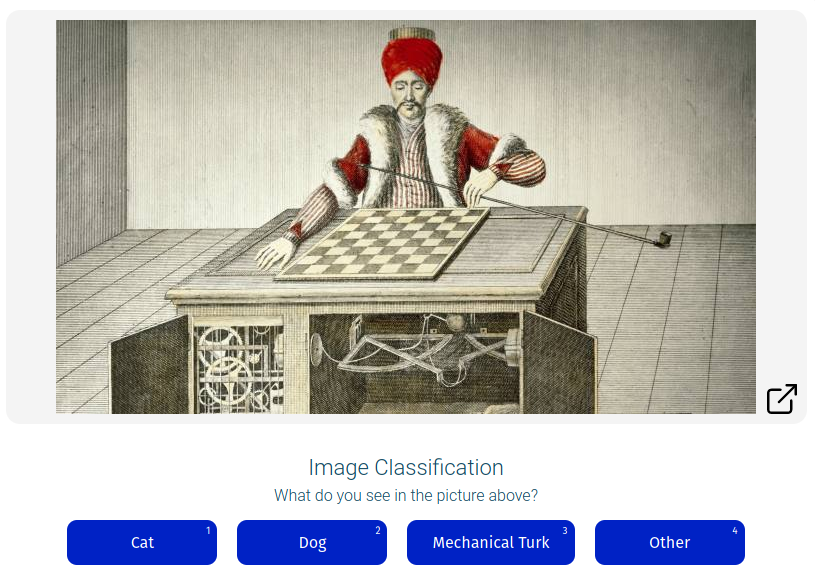

# Quickstart Guide

The quick start guide, we'll delve into how to use the Effect Network SDK so that you can publish tasks on the platform. 
The purpose of the Effect Network quickstart guide is to provide guided instruction on how to use the Effect Network SDK to interface with the Effect Network.

This guide goes through the following steps:
- Installing and initialising the SDK.
- Creating an account
- Getting Testnet EFX 
- Creating a campaign
- Creating a template
- Adding data to templates
- Publishing tasks to Effect Network
- Retreiving results

This will use a basic hello world example, the idea is, that you (the developer) will type along with this example to get a feel for how the sdk works and how to get set up and use the Effect Network.
So let's get started!

## Requirements
At the moment, our SDK is built using [TypeScript](https://www.typescriptlang.org/) you will need [NodeJS](https://nodejs.org/en/) in order to install the npm package. If you do not have NodeJS installed, you can find it here:
[Download NodeJS for your platform.](https://nodejs.org/en/download/)

:::tip 
Typescript is optional but the sdk does provide types for those that enjoy programming with Typescript.
:::

## Setup

### Step 1. Initializing project

Start the project by creating a directory and initializing it as an npm directory.

```bash
mkdir awesome-efx-project
cd awesome-efx-project
```

### Step 2. Installing the SDK
In your project folder, you can now start installing packages that will assist you in your journey.

<code-group>
<code-block title="NPM">
```bash
npm i @effectai/effect-js
```
</code-block>

<code-block title="YARN">
```bash
yarn add @effectai/effect-js
```
</code-block>
</code-group>

:::tip 
By default the npm package is provided in the CommonJS format. If you would like to use a different module format you can clone the repo, build the module format of your choice. 
<details>
<summary> Clone and build the code yourself. (Click 🢒 to toggle section) </summary>

To start, import the SDK using either `require` or `import` as needed. 
At the moment, the npm package only supports CommonJS exports. If it does not work as needed, you can clone the GitHub repo and build the needed module format yourself. 
There are three module formats supported at the moment: [[CommonJS](https://nodejs.org/docs/latest/api/modules.html), [UMD](https://github.com/umdjs/umd), [ES6](https://developer.mozilla.org/en-US/docs/Web/JavaScript/Guide/Modules)]


```
git clone git@github.com:effectai/developer-docs.git
npm install
npm run build:umd
# OR
npm run build:es


# Then, from your project folder, link back to the package
npm link /path/to/effect-js
```
</details>

<br>
:::


### Initializing the Effect Client

The first step is to import and intialize the client. Which will be the main object from which methods can be called in order to interact with the Effect Network. Import or require `@effectai/effect-js` as needed and pass the optional configuration object to the constructor.
The constructor can take a configuration object, but the constructor will initialize with a default configuration object if no configuration object is passed. 
It is usefull though to pass a `web3` object, so that the sdk has access to it. 
The first parameter for the constructor is which network to use. At the moment only testnet on `kylin` is supported. 
See the [Configuration](../sdk/) page for more information about the configuration object and it's default values.


<code-group>
<code-block title="require">
```javascript
const EffectSDK = require('@effectai/effect-js'); 

// Example sdkOptions, that are not needed right now. But are here for illuminating how to use the configuration object.
const sdkOptions = {
  network: 'kylin',
  host: 'api.kylin.alohaeos.com',
  signatureProvider: window.eos.wallet // Specify the eos wallet provider you want to use.
  web3: window.web3 // Specify the web3 instance you want to use.
}
const sdk = new EffectSDK.EffectClient('testnet', sdkOptions)

```

</code-block>
<code-block title="import">

```javascript
import { EffectClient } from '@effectai';

const sdkOptions = {
  network: 'kylin',
  host: 'api.kylin.alohaeos.com',
  signatureProvider: window.eos.wallet // Specify the eos wallet provider you want to use.
  web3: window.web3 // Specify the web3 instance you want to use.
}
const sdk = new EffectClient('testnet', sdkOptions)

```
</code-block>
</code-group>

## Creating an Account
Before you can publish campaigns on Effect Network, you need to create an account. This example will demonstrate how to do that using a virtual account. 

Create an account so you can start making transactions on the Effect Network. This way, you can pay for creating the campaigns and running them.

```js
await sdk.account.openAccount('account_name')
await sdk.account.getVAccountByName('account_name')
```

## Get Money 💸
Now that you have created an account, you will need to load up your account with EFX. As we are building on our app on testnet, we will need to get testnet EFX (called: UTL). Join our Discord server, join the hackathon channel and request EFX (UTL) from the Discord-bot 🤖.

:::tip Join to access the EFX Faucet
[Join Discord ](https://discord.gg/WsPVmaVhu3)
:::

## Check balance
After you have used the faucet to get your tokens, you will be able to get your account balance, make withdrawals and do transfers.

```js
// from account, to vaccount, amount in EFX
await sdk.account.getVAccountByName('account_name')
await sdk.account.getPendingBalance(accountid)


// from vaccount, to account, amount in EFX
await sdk.account.withdraw('from_vaccount_name', 'to_account_name', '1.0000')

// from vaccount, to vaccount, amount in EFX
await sdk.account.vtransfer('from_vaccount_name', 'to_vaccount_name', '1.0000')
```

## Create Campaign
Now that the client is initialized we can start thinking about creating a campaign and its subsequent batches and tasks. First, the campaign needs to be created, then the templates can be designed, and the batches created with the tasks to fill in the template.

When creating a campaign, we first need to specify a couple of parameters, such as the description and instructions. Which are easy; these are just strings. But there are more complex objects, such as the template.

### Creating a template.
A template is simply some vanilla HTML that has a placeholder value that will be replaced with data when it is presented to the worker as a task. That's a bit of a mouthful; let's break it down.

Let's imagine we have an image classification campaign; we want to identify if there are cats in the picture. We present a picture to the worker, and it is their task to identify what is in the picture. They see an image and are provided a list of options to choose from. 

:::tip Placeholder
Note the use of `${image_url}` in the template.

This is the variable that will be replaced by the array of data that is provided later on.
So later, the placeholder will be filled with `https://i.imgur.com/NP3BDFD.jpg` and rendered as the template below.
Of course, you can pass any `image_url` that you choose; in this quickstart guide, we will be looking at how to use IPFS.
:::

This is a template:
```html
<div id="task">
  <image src='${image_url}'></image>
  <h2>Image Classification</h2>
  <option submit name="button-answer" type="button" :options="['Cat','Dog','Mechanical Turk','Other']" label="What do you see in the picture above?"></option>
</div>
````

The template will render into the following:



### Define Campaign
Now that we understand how templates are rendered we can start prototyping the rest of the campaign. 
<!-- The function signature for campaign creation is:
`createCampaign (owner: string, accountId: number, nonce: number, hash: string, quantity: string, options: object)
The function signature for creating campaigns is as follows:` -->


:::danger EFFECT NETWORK INTERNAL
Rewrite this piece
:::
There are a couple of parameters that need to be filled in before the campaign can be created. Take a look at `campaginIpfs` to see what parameters are needed. After these are filled in, the campaign needs to be uploaded to IPFS using `uploadCampaign` function, the ipfs hash is then passed to the `createCampaign` function. That way the campaign data is not stored on the blockchain itself but can be easily referenced from the smart contract and your applications.


HTML template that will be passed to the `createCampaign` function. 


Uploading and creating campaign programmatically:
```js
const campaignIpfs = {
          title: 'Tree Friends 🐻',
          description: 'All the tree friends are lost. They need you to find them.',   // Description of the campaign
          instructions: 'Identify all the happy tree friends!',  // Instructions for workers on how to complete tasks, accepts Markdown
          // The template that will be used for the tasks
          template: `<div id="task">
                        <image src='${image_url}'></image>
                        <h2>Image Classification</h2>
                        <option submit name="button-answer" type="button" :options="['Cat','Dog','Mechanical Turk','Other']" label="What do you see in the picture above?"></option>
                      </div>`,      
          image: 'https://ipfs.image.store/ipfs/1234...xyz',         // Campaign image
          category: 'Image labeling',      // The category of the campaign
          example_task: {'https://ipfs.image.store/ipfs/1234...xyz' },  // Example task that will prefill the task form
          version: 1,        // Version of the campaign
          reward: 100        // Amount of EFX
        }

const hash = await this.$blockchain.uploadCampaign(campaignIpfs)
const result = await this.$blockchain.createCampaign(hash, this.campaignIpfs.reward)

console.log(result) // so that devs can take a look at the interface of their campaign
```
### Visit Testnet 
Visit [https://testnet.effect.network](https://testnet.effect.network) to see the campaign. This is also where you should be able to join your own campaign and work on it. 

### Creating batches and uploading task data

Is this automatically published when a batch is created?
Add a json file with an array of ipfs urls that can be used for the devs to add to their batches and fill in their tasks.

https://github.com/effectai/effect-js/blob/872d6d180fc977dc0c2037bc3688f4674285426a/src/force/force.ts#L232

```js
  
  /**
   * @param campaignOwner
   * @param permission
   * @param campaignId
   * @param batchId
   * @param content
   * @param repetitions
   * @returns
   */

    const batch = await createBatch(campaignOwner, campaignId, batchId, content, repititions, options)

```


## Wait for response
When the task is published, a worker will start working on it as soon as possible. When the worker is done with the task, it will be published on the blockchain, and then you will be able to retrieve it by calling the following method.


## Summary

So in summary the following things are needed to create a campaign:
- Installing the sdk
- Creating a virtual account
- Creating a campaign
- Creating batches and tasks
- Waiting for workers to complete the tasks
- Retrieving the results

