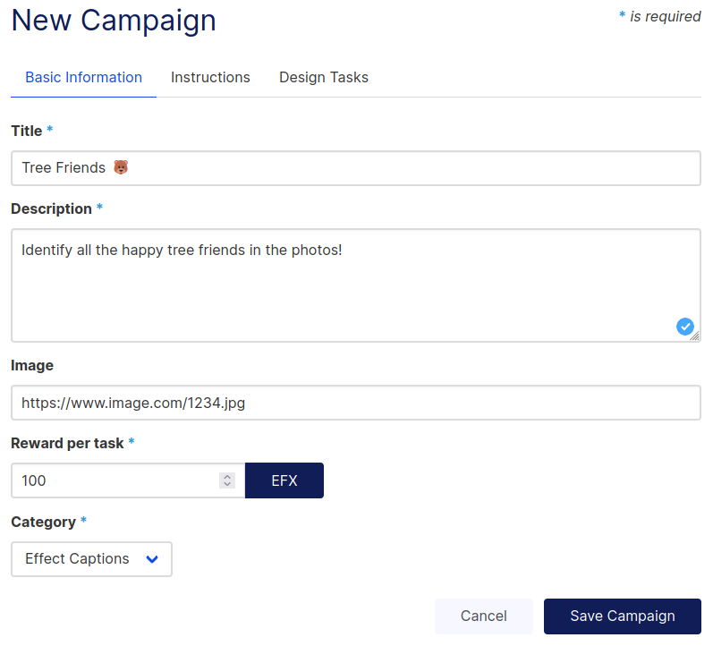
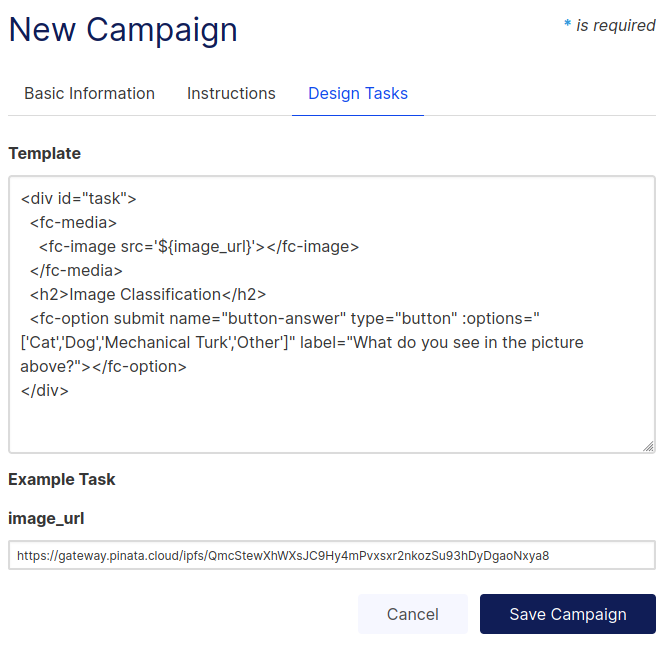

# Front-End Campaign Creation

### GUI campaign creation
It is also possible to use the GUI front-end to create campaigns instead of doing it programmatically. 

#### Campaign 
First fill out the nessecary information.

#### Campaign Instructions
Add instructions on how to complete the tasks

#### Create Task Template
A template needs to be created to describe the task. The template is some HTML code that needs to be embedded in the campaign. Notice in the following image how there is a  placeholder value for the task. This is the data that will be loaded into. The placeholder value is referenced by using the `${variable_name}` syntax.

